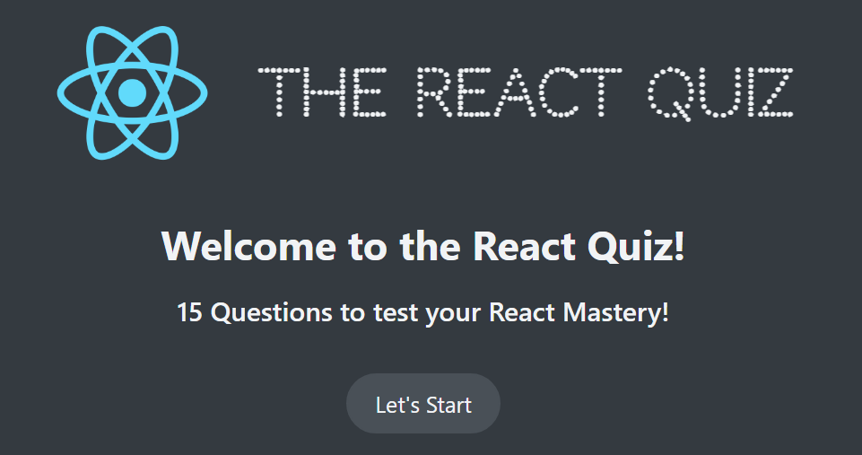
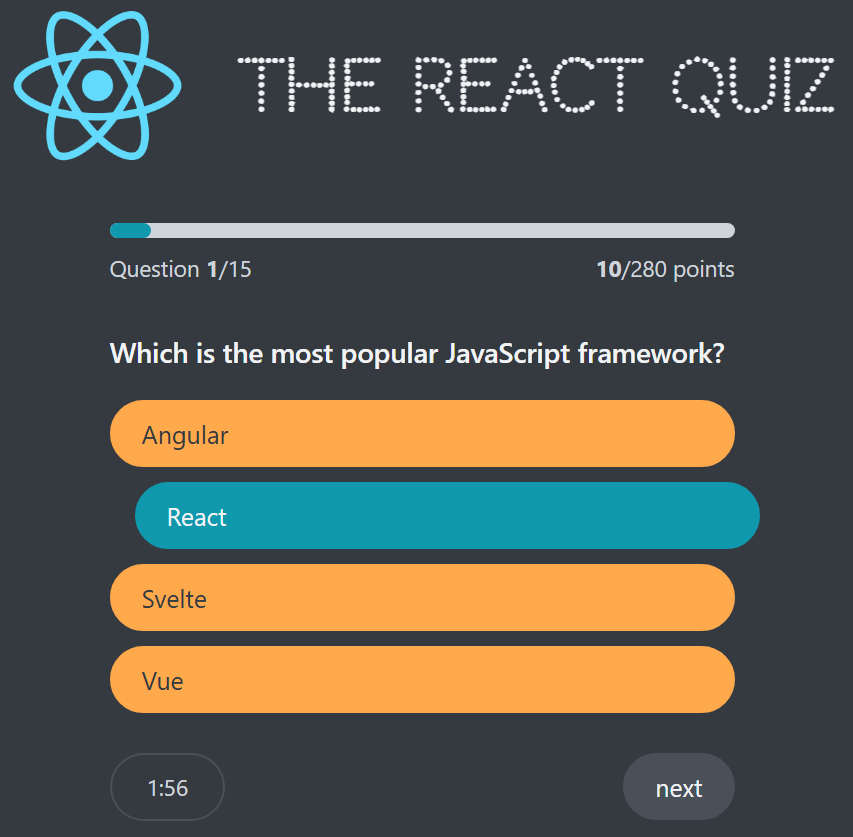
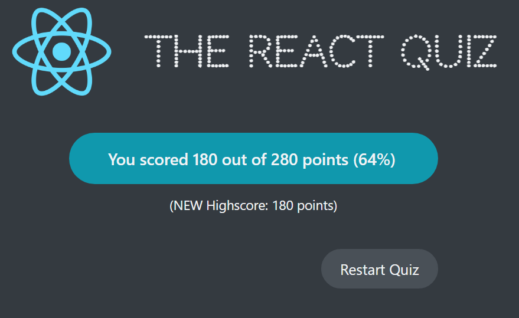

# React Quiz project

Own solution to the udemy course "The Ultimate React Course 2024: React, Next.js, Redux & More" project

## Run React App

- clone repository
- enter react-quiz project
- run `npm i json-server`
- run `npm run server` in terminal1
- run `npm start` in terminal2
